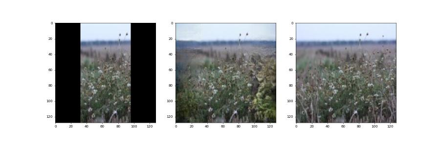
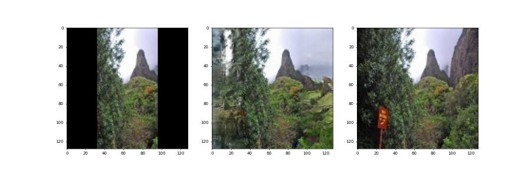

# Image Outpainting with GAN - PyTorch Implementation

This is an example of a generator that performs the task of outpainting. On the left is the image input to the generator, in the middle is the result obtained by the generator, and on the right is the ground truth. Cropped 128x64 images are used as input to the generator, at the output we get 128x128 images, which are compared with the original ones.

## Examples

## Usage

1. Prepare a dataset split into the folowing folders: *train/gt* and *val/gt*.
2. Run `prepare.py 64 128` and `prepare.py 64 128 val`. Arguments in the *prepare.py* means 'cropped size', 'output size' and 'destination folder' respectively.
3. For training your own model edit `default.yaml` and run `train.py default.yaml`.
5. Run `generate.py input.jpg output.jpg expand_size` for evaluation of custom images. This script uses `logs/models/final/final.tar` to load network weights.

## Pretrained model

* [Final model](https://disk.yandex.ru/d/qiqtFApug5h2zQ): Places365

Enjoy!
