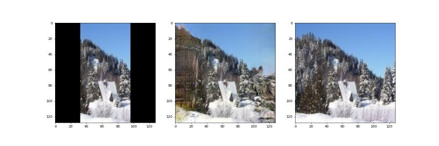
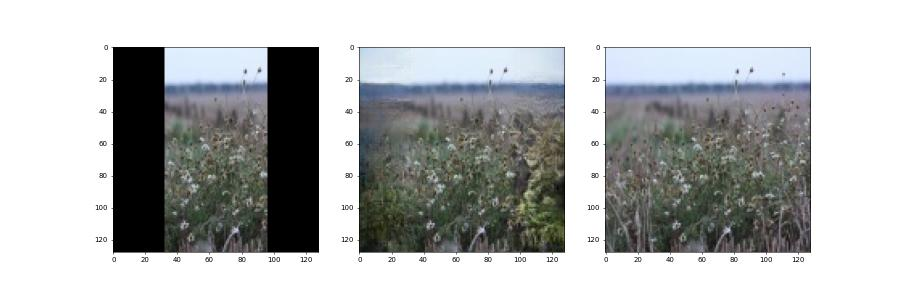
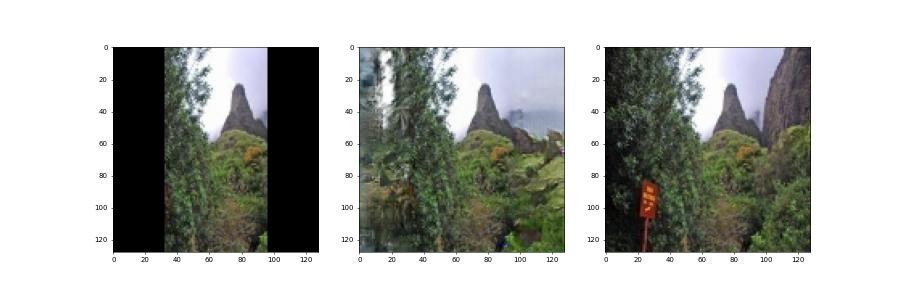

# Image Outpainting with GAN - PyTorch Implementation

This is an example of a generator that performs the task of outpainting. On the left is the image input to the generator, in the middle is the result obtained by the generator, and on the right is the ground truth. Cropped 128x64 images are used as input to the generator, at the output we get 128x128 images, which are compared with the original ones.

## Examples

## Method

We used the approach described in the articles [1](https://arxiv.org/abs/1808.08483), [2](http://iizuka.cs.tsukuba.ac.jp/projects/completion/data/completion_sig2017.pdf), which includes the use of a local discriminator. In addition, we used the structural similarity loss function for Generator SSIM[3](https://arxiv.org/abs/1511.08861) and pixel loss function L1.

## Usage

1. Install pytorch implementation of SSIM Loss function: https://github.com/VainF/pytorch-msssim
2. Prepare a dataset split into the folowing folders: *train/gt* and *val/gt*.
3. Run `Prepare.py 64 128` and `Prepare.py 64 128 val`. Arguments in the Prepare.py means 'cropped size', 'output size' and 'destination folder' respectively.
4. For training your own model edit and run `Train.ipynb`.
5. Run `Generate.py input.jpg output.jpg expand_size` for evaluation of custom images. This script uses `generator_final.tar` to load network weights.

## Pretrained model

* [Generator_final.tar](https://drive.google.com/file/d/1C7SYYDUpgONSz2Vq1FISY-KiISvnezCR/view?usp=sharing): Places365

Enjoy!
